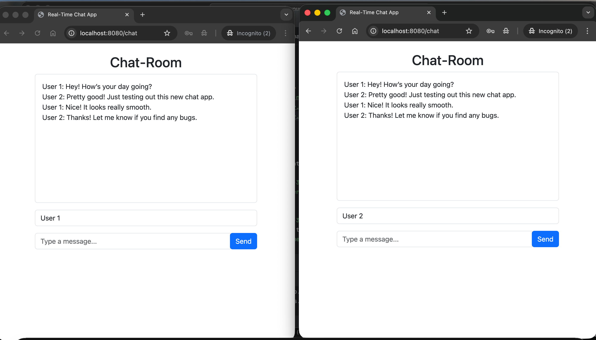

# 💬 Simple-Chat-Room

A fully functional real-time group chat built using Spring Boot WebSockets + STOMP.
Multiple users can join, send messages, and instantly see updates across all connected browsers - zero refresh, zero delay.  

---
## Things Learned:
- Real-time communication with WebSockets
- Setting up WebSockets in Spring Boot
- Using STOMP for structured message flow
- Chat message broadcasting controller
- Frontend using SockJS + STOMP.js
- UI rendering with Thymeleaf
- Handling multiple users
- Structuring chat messages

---
## 🚀 Tech Stack
Backend
- Java Spring Boot
- Spring WebSocket
- STOMP Protocol
- Thymeleaf
  
Frontend
- HTML / CSS
- JavaScript (ES6)
- SockJS
- STOMP.js 

---

💡 How It Works (In Short)

1. Client connects to /chat WebSocket endpoint.

2. Subscribes to /topic/messages.

3. When someone sends a message:

4. Frontend sends it to /app/send-message.

5. Backend receives & broadcasts to /topic/messages.

6. All clients instantly receive and display the message.

✔️ Result: A smooth, real-time group chat experience.

---

